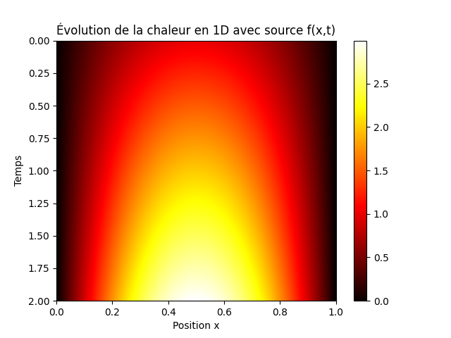
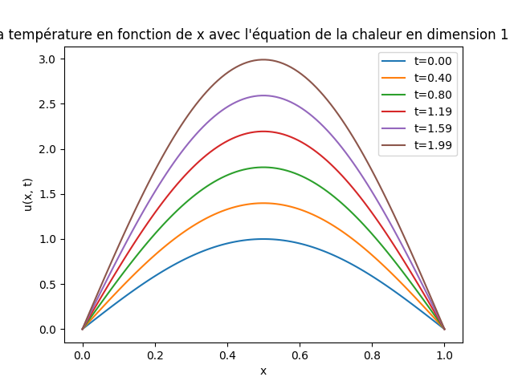
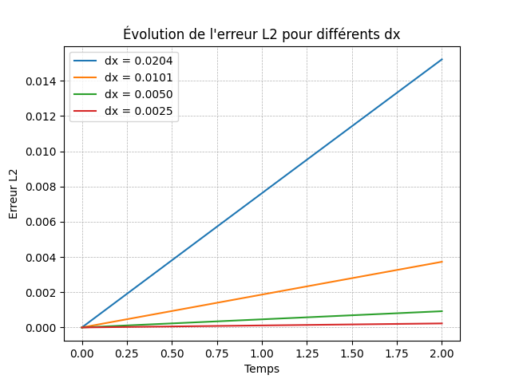
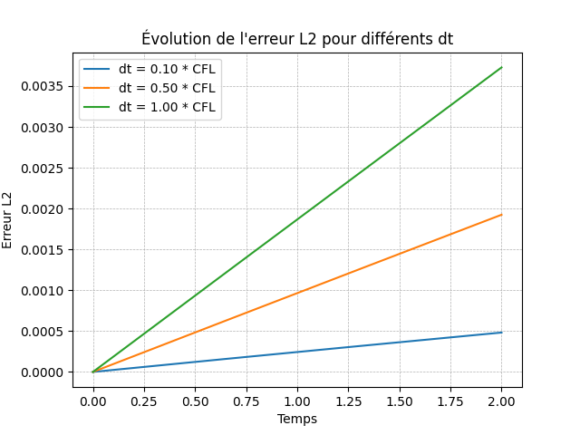
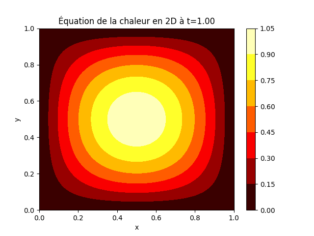
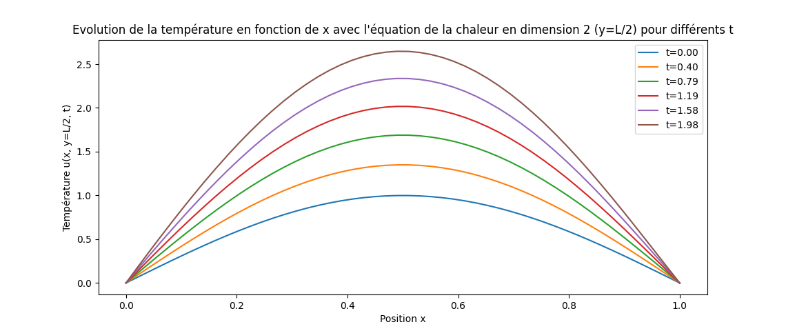
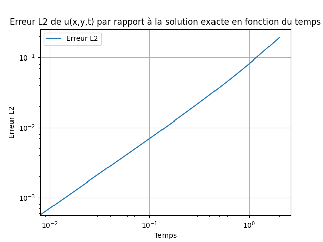

# Numerical Analysis of the 1D & 2D Advection-Diffusion Equation

## Quick Start & Reproduction

This project is contained in a single, well-commented Python script (`EDP_Project_1D_and_2D.py`). To reproduce the results and generate all graphs:

1.  **Clone or download the repository.**
2.  **Install dependencies:** `pip install -r requirements.txt`
3.  **Run the script:** `python EDP_Project_1D_and_2D.py`

The script will execute all simulations, print the final L2 errors to the console (and save them in `results/output.txt`), and save all visualizations in the `results/` directory.

---

## 1. Project Report: Abstract

This report details the development and validation of a numerical solver for the 1D and 2D advection-diffusion equation, a fundamental Partial Differential Equation (PDE) modeling phenomena like heat transfer. Implemented in Python using NumPy, Matplotlib, and SymPy, this project focuses on applying a **Finite Difference Method (FDM)** to simulate temperature evolution under both diffusion and convection forces.

The core of this work lies in the **rigorous validation of the numerical scheme**. By leveraging SymPy to derive a source term from a known analytical solution, we conduct a quantitative error analysis using the **L2 norm**. The results confirm the solver's accuracy and demonstrate its convergence properties, validating the implementation's correctness and stability.

## 2. Methodology

The project solves the advection-diffusion equation:
$$ \frac{\partial u}{\partial t} = D \nabla^2 u - \vec{C} \cdot \nabla u + f(\vec{x}, t) $$
A **Forward-Time Centered-Space (FTCS)** finite difference scheme was implemented. The stability of this explicit scheme is ensured by respecting the Courant-Friedrichs-Lewy (CFL) condition, which constrains the time step `dt` relative to the spatial step `dx`.

## 3. Results and Analysis

### 3.1. One-Dimensional (1D) Analysis

#### **Qualitative Results: Temperature Evolution**

The 1D simulation accurately captures the evolution of a temperature profile along a rod. The two graphs below show the solution's behavior both at discrete time steps and over the entire spatiotemporal domain.

<table>
  <tr>
    <td align="center"><strong>Evolution of u(x, t) vs. x</strong></td>
    <td align="center"><strong>Spatiotemporal Heatmap</strong></td>
  </tr>
  <tr>
    <td></td>
    <td></td>
  </tr>
  <tr>
    <td align="center"><em>Figure 1: Temperature profile at different time steps.</em></td>
    <td align="center"><em>Figure 2: Heatmap of temperature evolution over time and space.</em></td>
  </tr>
</table>

**Analysis:** Figure 1 shows the sinusoidal profile evolving over time while correctly adhering to the zero-value Dirichlet boundary conditions. Figure 2 provides a global view, clearly showing the temperature increase across the domain due to the source term.

#### **Quantitative Results: Error Analysis and Convergence**

The accuracy of the 1D solver is excellent. The final relative L2 error against the exact analytical solution is **0.1464%**, confirming a very close match between the numerical and theoretical results.

A convergence study was conducted to validate the robustness of the solver.

<table>
  <tr>
    <td align="center"><strong>L2 Error vs. Spatial Step (dx)</strong></td>
    <td align="center"><strong>L2 Error vs. Time Step (dt)</strong></td>
  </tr>
  <tr>
    <td></td>
    <td></td>
  </tr>
  <tr>
    <td align="center"><em>Figure 3: L2 error evolution for different `dx` values.</em></td>
    <td align="center"><em>Figure 4: L2 error evolution for different `dt` values.</em></td>
  </tr>
</table>

**Analysis:** Figures 3 and 4 are crucial for validation. They demonstrate that as the spatial step `dx` and the time step `dt` are refined (made smaller), the L2 error of the solution systematically decreases. This behavior confirms that our numerical solution **converges** towards the true analytical solution, which is the primary goal of a robust numerical method.

### 3.2. Two-Dimensional (2D) Analysis

#### **Qualitative Results: Temperature Evolution on a 2D Plate**

The 2D simulation models the temperature on a square plate. The results effectively illustrate the more complex interplay between diffusion spreading heat from the central peak and convection introducing a visible asymmetry.

<table>
  <tr>
    <td align="center"><strong>Temperature at Final Time</strong></td>
    <td align="center"><strong>Profile Evolution at y=L/2</strong></td>
  </tr>
  <tr>
    <td></td>
    <td></td>
  </tr>
  <tr>
    <td align="center"><em>Figure 5: Heatmap of the 2D temperature field `u(x, y, T)`.</em></td>
    <td align="center"><em>Figure 6: Temperature profile along the central line `y=L/2`.</em></td>
  </tr>
</table>

**Analysis:** Figure 5 shows the final state, where the peak temperature is shifted from the center due to the advection terms `Cx` and `Cy`. Figure 6, a cross-section of the 2D field, shows a temporal evolution consistent with the 1D case.

#### **Quantitative Results: Error Analysis**

The final relative L2 error for the 2D simulation was found to be **14.5199%**.

*Figure 7: Log-log plot of the 2D L2 error evolution over time.*

**Analysis:** The higher error in the 2D case is an expected and insightful result. It highlights the limitations of the simple FTCS scheme when applied to more complex, higher-dimensional problems. The accumulation of discretization errors over two spatial dimensions and time leads to a greater deviation from the exact solution. This result suggests that for higher accuracy in 2D, more advanced numerical schemes (e.g., Crank-Nicolson, higher-order methods) would be necessary. The analysis of this limitation is, in itself, a key finding of the project.

## 4. Conclusion

This project successfully demonstrates the implementation of a stable and accurate finite difference solver for the advection-diffusion equation.

- The **1D solver** proved to be highly accurate (0.1464% relative error) and its convergence was validated.
- The **2D solver**, while functionally correct in simulating the physical phenomena, highlighted the accuracy limitations of the FTCS scheme in higher dimensions (14.5% relative error).

This work solidifies my proficiency in:
- **Numerical Methods:** Implementing finite difference schemes for PDEs.
- **Error Analysis:** Quantitatively assessing the accuracy and convergence of numerical algorithms.
- **Scientific Computing in Python:** Utilizing NumPy for vectorized computations, Matplotlib for data visualization, and SymPy for symbolic mathematics.
- **Critical Analysis:** Interpreting numerical results, including understanding the limitations and trade-offs of the chosen algorithms.
